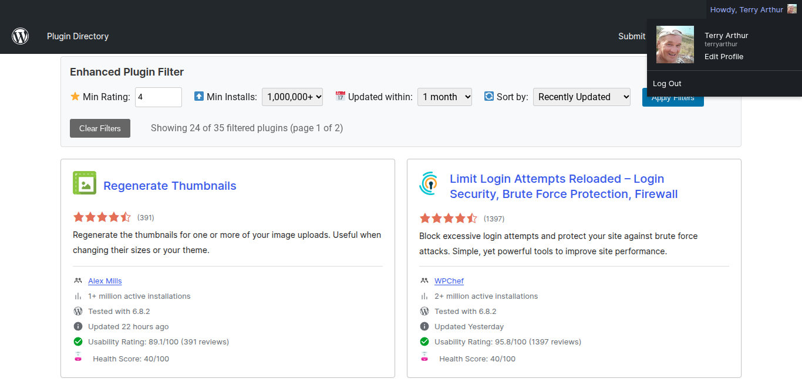

# WordPress Plugin Directory Search Filters

A powerful Chrome extension that adds advanced search filters to the WordPress.org plugin directory, making it easier than ever to find exactly what you need.



## 🚀 Features

### 🔍 Advanced Filtering
Filter plugins by downloads, ratings, last updated date, and categories for precise results.

### 🏥 Plugin Health Score
See comprehensive health scores based on maintenance, compatibility, and security metrics.

### ✅ Usability Rating
Filter by user experience ratings and ease-of-use metrics to find developer-friendly plugins.

## 🛠️ What This Extension Does

- Adds advanced filtering options to the WordPress Plugin Directory
- Provides plugin health scores and ratings
- Enhanced search and sorting capabilities
- Improved user interface for better plugin discovery

## 📥 Installation

⚠️ **Important Notice**: This extension is not available on the Chrome Web Store and requires manual installation. Chrome may show security warnings for extensions installed outside the store.

### Installation Steps

1. **Download the extension**: Download the `.crx` file from the releases
2. **Chrome will show a warning**: Click "Keep" if Chrome blocks the download
3. **Install the extension**:
   - Open Chrome and go to `chrome://extensions/`
   - Enable "Developer mode" in the top right
   - Drag and drop the downloaded `.crx` file onto the extensions page
   - Click "Add extension" when prompted
4. **Alternative method**: If drag-and-drop doesn't work, use "Load unpacked" and select the extracted folder

## 🔧 How It Works

1. **Install Extension**: Download and install the extension manually
2. **Visit WordPress.org**: Navigate to the WordPress plugin directory as you normally would
3. **Enhanced Search**: Enjoy powerful new filtering and sorting options automatically added to the page

## 🔒 Security & Privacy

- This extension only works on wordpress.org/plugins pages
- No data is collected or transmitted to external servers
- All processing happens locally in your browser
- Open source - you can review the code

## ❓ Troubleshooting

- **Installation blocked**: Enable "Developer mode" in `chrome://extensions/`
- **Extension not working**: Refresh the WordPress plugin directory page
- **Still having issues**: Try the "Load unpacked" method with the extracted folder

## 🛡️ Browser Support

This extension requires Google Chrome. Please open this page in Chrome to install.

## 📁 Project Structure

```
wp-plugin-filter-extension/
├── background.js          # Extension background script
├── content.js            # Content script for WordPress.org
├── inject-ui.css         # Styling for injected UI elements
├── manifest.json         # Extension manifest
├── icons/               # Extension icons
│   ├── icon48.png
│   └── icon128.png
└── wppd-filters/        # Distribution folder
    ├── background.js
    ├── content.js
    ├── inject-ui.css
    ├── manifest.json
    └── icons/
```

## 🤝 Contributing

Contributions are welcome! Please feel free to submit a Pull Request.

## 📞 Contact

**Built by Terry Arthur**

An AI-enhanced developer and human passionate about improving developer workflows and user experiences.

📧 **Get in touch**: [terryarthur@gmail.com](mailto:terryarthur@gmail.com?subject=WPPD%20Search%20Filters%20Extension)

Have questions or feedback? Whether you have feature requests, bug reports, or just want to say hello, I'd love to hear from you!

## 📄 License

© 2025 Terry Arthur. All rights reserved.

---

*WordPress Plugin Directory Search Filters Chrome Extension*